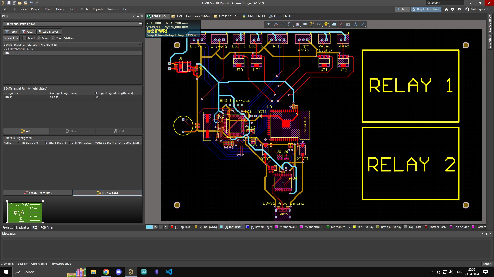
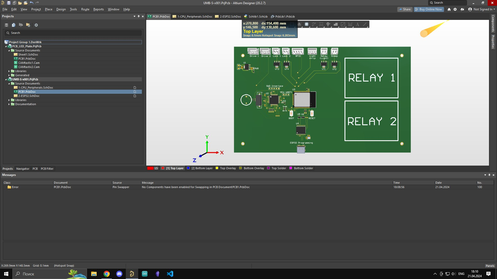

# iKrypt
Прошивка для первой версии управляющей платы скрытого домашнего хранилища "iKrypt"

В этом репозитории вы можете найти source код старой версии прошивки (новая будет доступна позже), а также 
скриншоты из Altium Designer с 2D и 3D видами старой и новой версий платы управления, и скриншоты мобильного приложения.
Движение отсеков реализовано с помощью шаговых моторов и различных кинематических систем. Управление происходит через мобильное приложение по Bluetooth либо Wi-Fi.

Разработка платы ведется в Altium Designer 20. Старая версия платы была Arduino-shield'ом для Arduino Mega 2560. В новой версии
МК разведены на плате (а это AT32F403 и ESP32). На борту поддержка Bluetooth/Wi-Fi, RFID, управление несколькими шаговыми двигателями (DIR/STEP драйвера внешние),
также управление подсветкой (адресная светодиодная лента) и спящий режим.
Размеры платы были определены инженером-конструктором.

